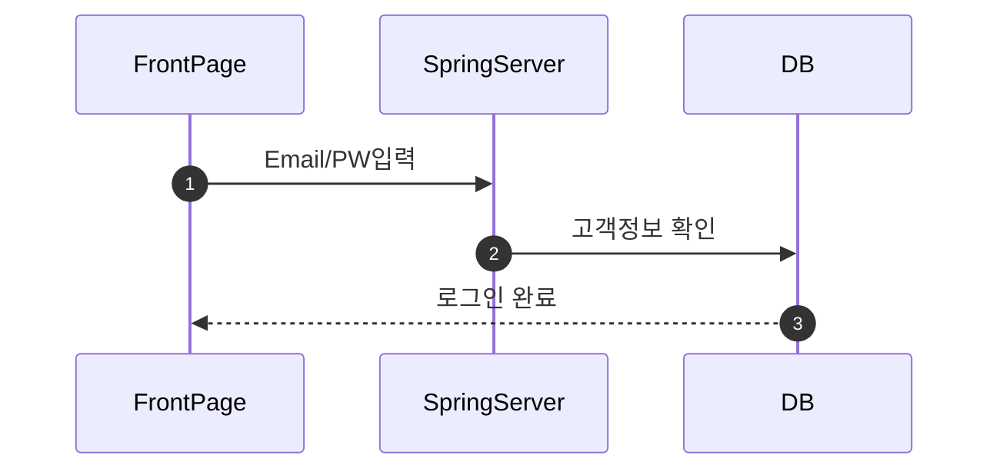
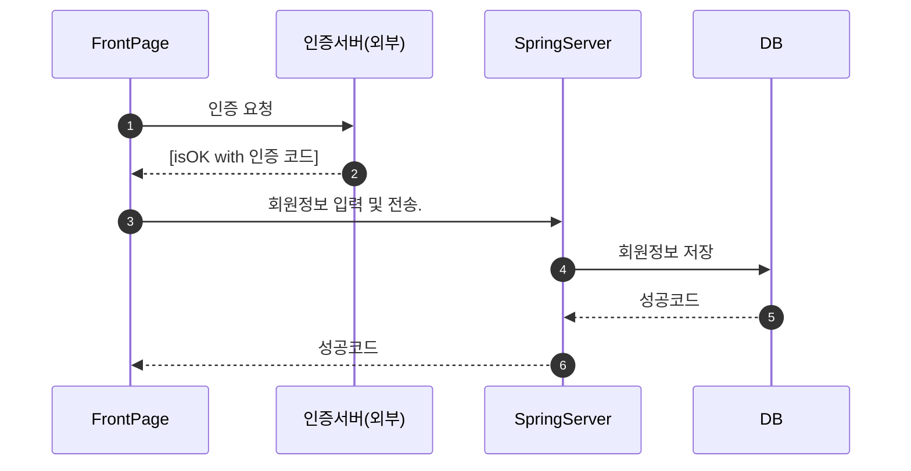
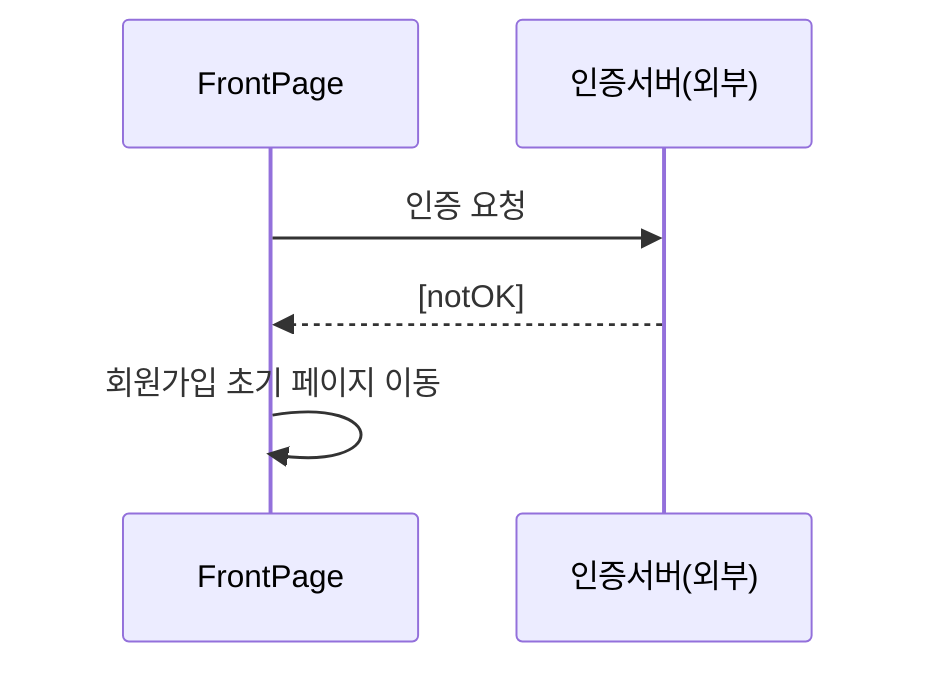
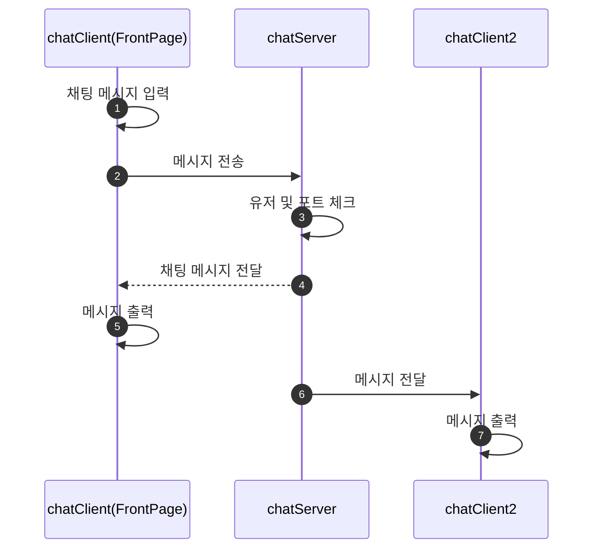

# MIT(My IT Team - SNS PJT)

## 1. 로그인

로그인은 간단하게 email, PW 입력  DB를 확인하여 로그인을 진행

## 2. 회원 가입

실명 인증은 별도의 실명 인증 서버를 거쳐 OK를 받으면 저장한다. 

#### 인증 성공의 경우

#### 인증 실패의 경우

## 3. 채팅

채팅 서버는 별도의 채팅 서버를 거쳐 서비스 된다.

## 4. 메인페이지

공모전, 프로젝트 정보를 간단하게 보여주는 페이지

## 5. 공모전, 프로젝트 페이지

공모전, 프로젝트 정보를 간단하게 보여주는 페이지

## 6. 팀원 모집페이지

공모전, 프로젝트 정보를 간단하게 보여주는 페이지

## 7. 팀 등록 페이지

공모전, 프로젝트 정보를 간단하게 보여주는 페이지

## 8. 팀 관리 페이지

공모전, 프로젝트 정보를 간단하게 보여주는 페이지