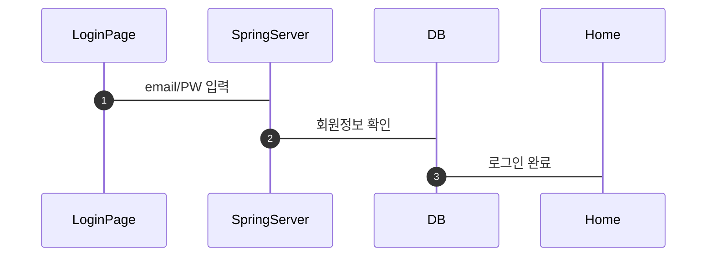
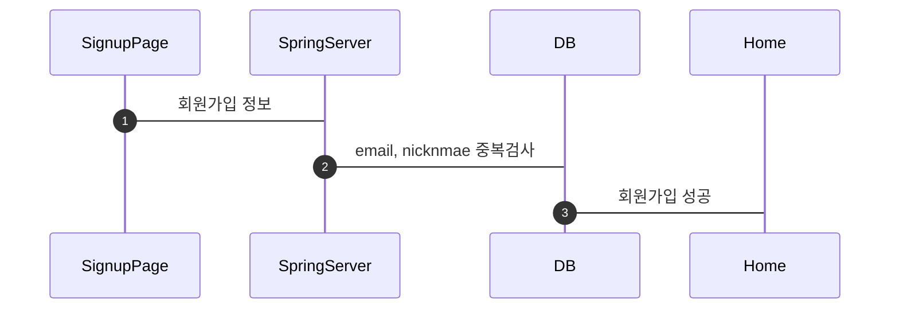
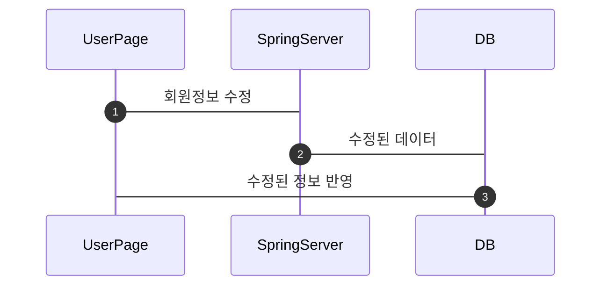
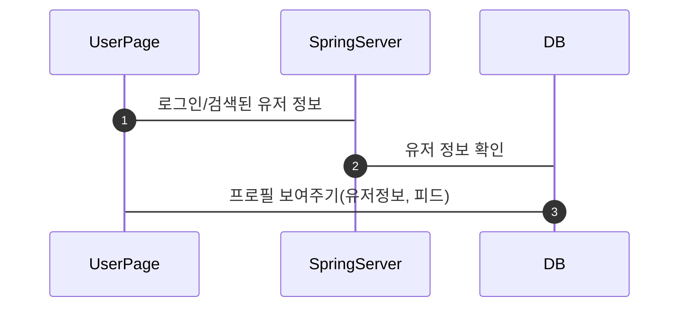
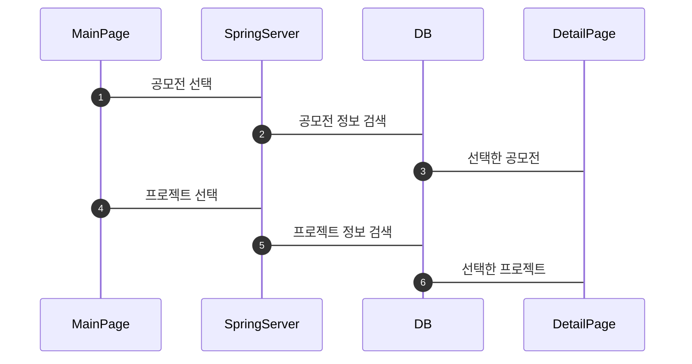
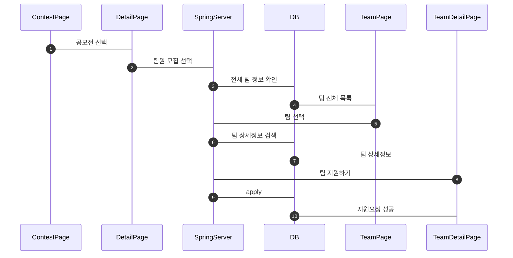
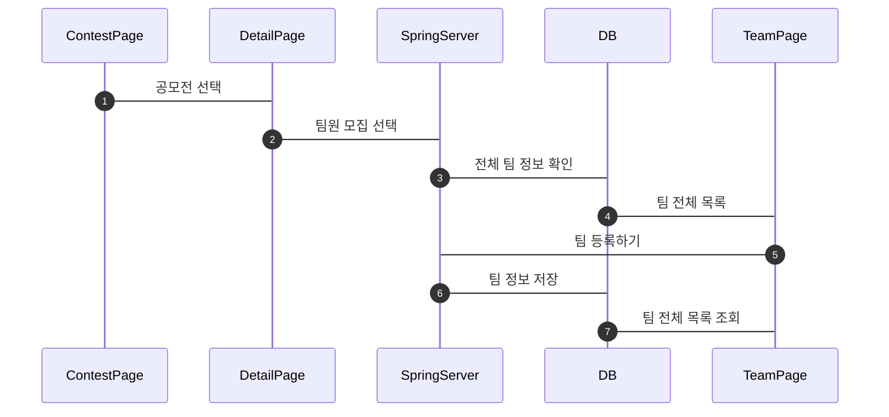
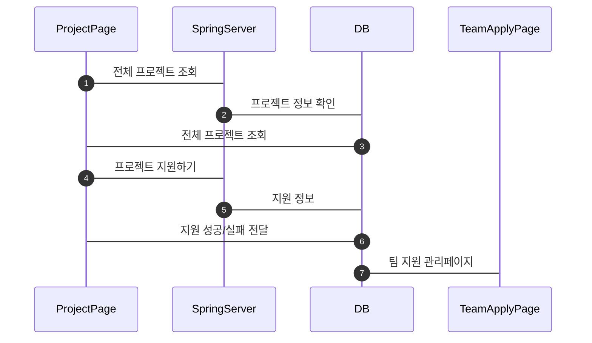
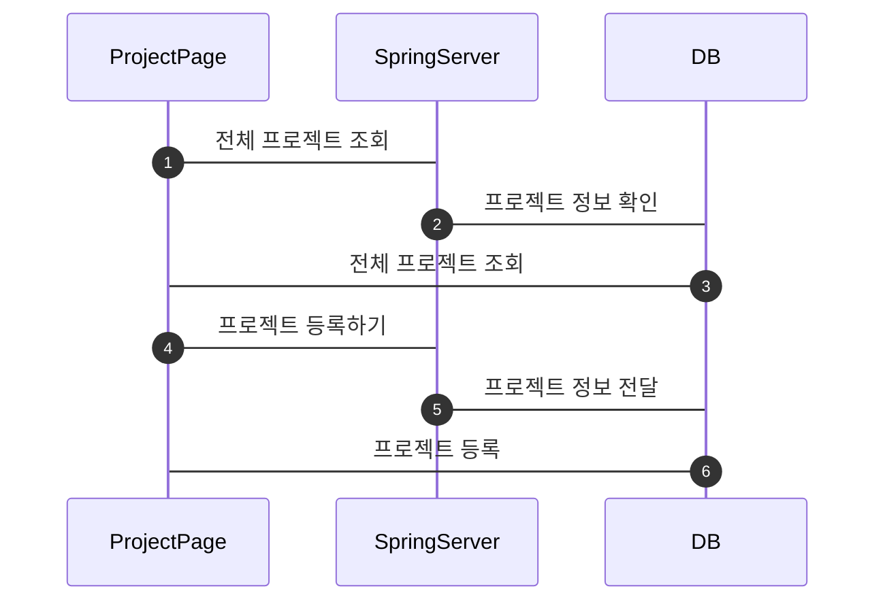
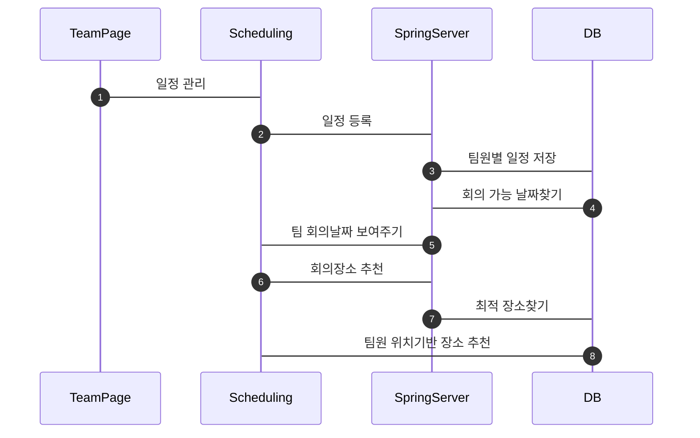

# MIT(My IT Team)

## 1. 로그인

로그인은 email, PW 입력 후 DB를 확인해 로그인을 진행

## 2. 회원가입

email, nickname 중복검사 후 회원가입 진행

## 3. 계정설정

로그인 후 이용가능, 수정된 데이터를 저장후 갱신

## 4. 유저페이지(profile)

유저정보(닉네임, 팔로우, 자기소개 등) 보여주고 유저의 피드를 보여줌

## 5. 메인 페이지

인기 공모전, 프로젝트를 보여준다. 클릭 시 해당 공모전, 프로젝트로 이동

## 6. 공모전 페이지

#### 공모전 팀 지원하기

#### 공모전 팀 등록하기

## 7. 프로젝트 페이지

#### 프로젝트 지원하기

#### 프로젝트 등록하기

## 8. 팀 관리 페이지

팀 생성 후 팀원 정보를 받아온다. 일정관리(회의 가능 날짜, 회의장소 추천)

