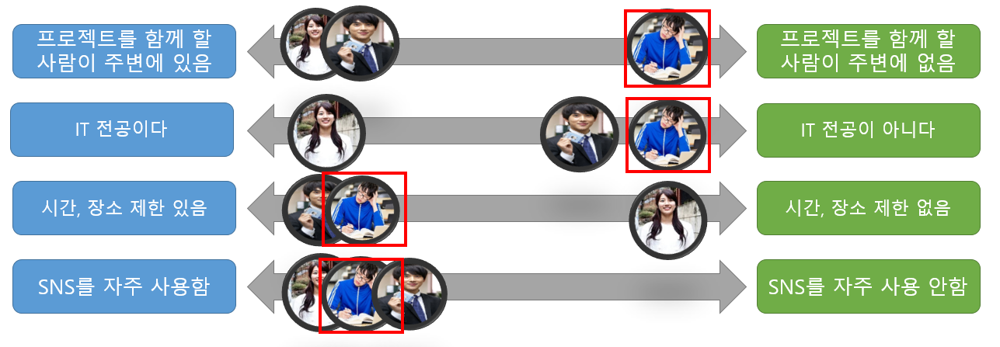
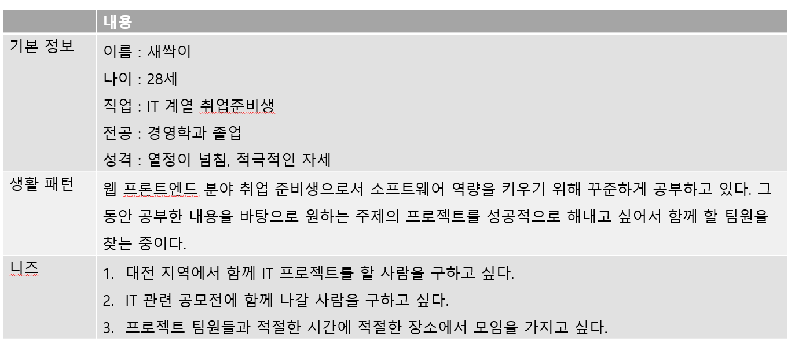

# 페르소나

### 1. 첫 번째 페르소나 

#### < 프로필 >

- 이름 : 새싹이 

- 나이 : 28살 

- 전공 : 경영학과

- 지역 : 대전

- 직업 : 취업 준비생

- 성격 : 열정이 넘침, 적극적인 자세

  

#### <행동 변수 도출>

- 행동 
  - 웹 프론트엔드에 분야에 관심이 많아서, 그 분야로 취업을 하기 위해 준비하고 있다. 
  - 취업 준비생이다보니 매일 공부를 하고 있다. 
  - 다양한 언어와 툴 사용법을 배우는 것을 좋아한다. 

- 소질, 태도 
  - SNS를 통해 다른 사람들과 정보를 공유하고 함께 공부하는 태도 
- 기술
  -  웹 프론트엔드 개발 역량 - Vue, Js 뛰어남
- 동기
  - 비전공자다 보니 함께 하고싶은 프로젝트를 진행할 팀원이 주변에 없음. 
  - 포트폴리오에 작성할 프로젝트를 함께 할 팀원을 모집하기 위해 사용

- 생활 패턴
  - 웹 프론트엔드 분야 취업 준비생으로서 소프트웨어 역량을 키우기 위해 꾸준하게 공부하고 있다. 그 동안 공부한 내용을 바탕으로 원하는 주제의 프로젝트를 성공적으로 해내고 싶어서 함께 할 팀원을 찾는 중이다. 
- 니즈 
  1. 대전 지역에서 함께 IT 프로젝트를 할 사람을 구하고 싶다. 
  2. IT 관련 공모전에 함께 나갈 사람을 구하고 싶다. 
  3. 프로젝트 팀원들과 적절한 시간에 적절한 장소에서 모임을 가지고 싶다. 

### 2. 두 번째 페르소나 

#### < 프로필 >

- 이름 : 샌애기

- 나이 : 20살 

- 전공 : 컴퓨터공학과

- 지역 : 서울

- 직업 : 대학생

- 성격 : 새로운 사람 만나는걸 좋아함, 도전하는 것에 무서워하지 않음 

#### <행동 변수 도출>

- 행동 
  - 소프트웨어에 관심이 많아서 컴퓨터공학과에 진학하였다.
  - 소프트웨어의 다양한 분야에 도전해서 배우고 싶어 한다. 
  - 사람 만나는 것을 좋아하고, 팀 프로젝트 하는 것을 즐긴다. 

- 소질, 태도 
  - SNS를 통해 다른 사람들과 정보를 공유하고 함께 공부하는 태도 
- 기술
  -  JAVA 언어를 잘 다룬다. 
- 동기
  - 학교에서는 아직 이론을 배우고 있기 때문에 외부에서 프로젝트를 진행해 경험을 쌓고 싶어 서 이 기능을 사용한다. 
  - 사람을 만나는 것을 좋아하기 때문에 같은 관심 분야를 가진 다양한 사람들과 소통하고 싶어서 이 기능을 사용한다. 

- 생활 패턴
  - 이제 막 대학교에 진학한 20살 대학생이다. 학교에서 다양한 이론을 배우는 것도 좋아하지만, 자신이 가진 역량을 바탕으로 다양한 프로젝트를 진행해 경험을 쌓고 싶어한다. 그래서 함께 프로젝트를 진행할 실력자들을 찾고 있고, 같은 관심 분야를 가진 사람들과 정보를 공유하고 싶어한다. 
- 니즈 
  1. 서울 지역에서 함께 IT 프로젝트를 할 사람을 구하고 싶다. 
  2. 같은 관심 분야를 가진 사람들과 정보를 공유하며 소통하고 싶어한다. 
  3. 프로젝트 팀원들과 적절한 시간에 적절한 장소에서 모임을 가지고 싶다.

### 3. 세 번째 페르소나

#### < 프로필 >

- 이름 : 이도비

- 나이 : 33살 

- 전공 : 통계전공

- 지역 : 인천

- 직업 : 회사원

- 성격 : 일 중독, 자기 개발 하는 것을 좋아한다. 

#### <행동 변수 도출>

- 행동 

  - 현재 회사에서 통계 관련 일을 하고 있다. 
  - 일을 하면서 데이터 베이스를 다루는 작업에 즐거움을 느껴서 이 역량을 바탕으로 퇴근 후에도 다양한 프로젝트를 진행하면서 다양한 분야에서 역량을 쌓고 싶어 한다. 

- 소질, 태도 

  - SNS를 통해 다른 사람들과 정보를 공유하고 함께 공부하는 태도 

- 기술

  -  데이터 베이스를 잘 다룬다.

- 동기

  - 본인이 기획한 아이템에 대한 프로젝트를 진행하고 싶다. 

  - 회사원이기 때문에 개인적으로 프로젝트를 진행하기 위해서는 평일 저녁, 주말에만 시간이 가능하다. 
  - 그래서 본인과 시간이 잘 맞는 사람들을 찾아서 프로젝트를 진행하기 위해서 이 기능을 사용한다. 

- 생활 패턴

  - 6시에 칼 퇴근을 하는 회사원이지만 본인의 역량을 퇴근 후에도 키우고 싶어한다. 그래서 퇴근 후에도 다양한 스터디에 참여하고, 공모전에 참여하는 등 꾸준하게 자기 개발을 위해 노력하며 살고 있다. 본인이 기획한 새로운 프로젝트를 진행하기 위한 팀원을 모집하는데 노력을 기울이고 있다.  

- 니즈 

  1. 인천 지역에서 함께 IT 프로젝트를 할 사람을 구하고 싶다. 
  2. 나와 같은 시간에 만나서 프로젝트를 진행 할 수 있는 팀원을 구하고 싶다. 
  3. 본인이 기획한 프로젝트를 함게 할 팀원을 구하고 싶다. 

### 4. 행동 변수 매핑 

- 1순위 : 20대 취업 준비생
- 2순위: 20대 대학생, 30대 회사원

### 5. 1순위 페르소나 분석

